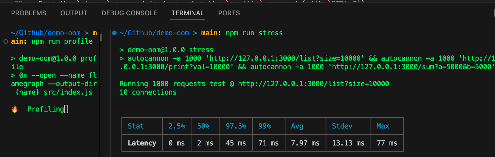
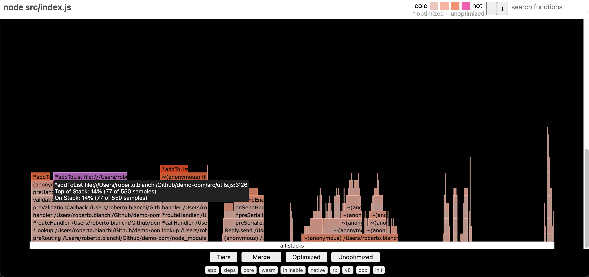

# demo-oom

Demo project to demonstrate how to debug Out of Memory issues, and more in general performance bottlenecks.

## Setup

Follow those commands:

```
npm i
npm run start
```

Now you can retrieve data from the endpoints:

```
# output => {"result":100}
curl 'http://127.0.0.1:3000/list?size=100'
# output => {"result":200}
curl 'http://127.0.0.1:3000/list?size=100'
# output => {"result":300}
curl 'http://127.0.0.1:3000/list?size=100'

# output => {"sum":42}
curl 'http://127.0.0.1:3000/sum?a=12&b=30'

# output => {"value":"42!"}
curl 'http://127.0.0.1:3000/print?val=42'
```

## Detect OoM

### Easy

- Run `npm run start`
- Open the `Activity monitor` (or the equivalent for your OS) and be sure to show the `Memory` tab and to filter by `node`
- Run `npm run stress`
- See how the `Memory` value changes over time

### Advanced

- Run `npm run inspect`
- Open a new Chrome tab `chrome://inspect/#devices`
- Click `Inspect` on the `Remote Target` pointing to `src/index.js`
- On the `Memory` tab, select `Allocation sampling` and click `Start`
- Run `npm run stress`
- Once finished, click `Stop` on the DevTools opened window
- Analyze the results, in particular the `Total Size`

## Detect performance bottlenecks

Run `npm run profile` on one window (wait for `🔥  Profiling` message), then `npm run stress` on another one:


Once the `stress` command is done, stop the `profile` command (with `CTRL-C`).

You should see the message `🔥 Flamegraph generated in` and a new browser tab should be opened with a similar result to what you can see in the `./out` folder:

